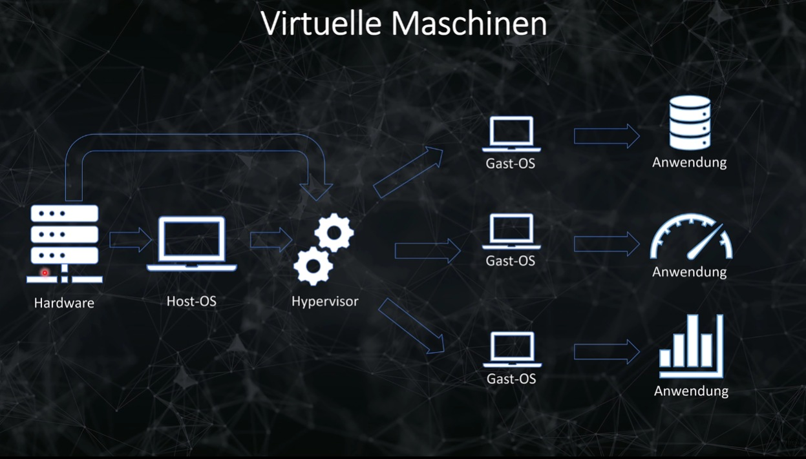
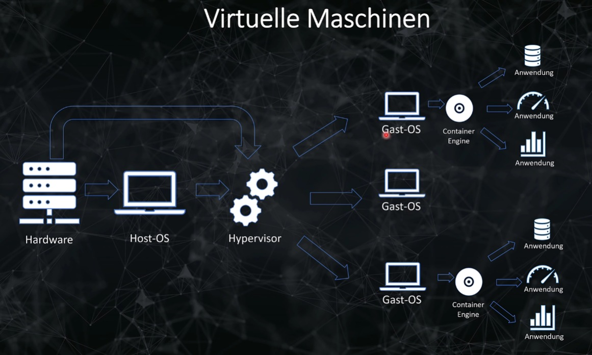
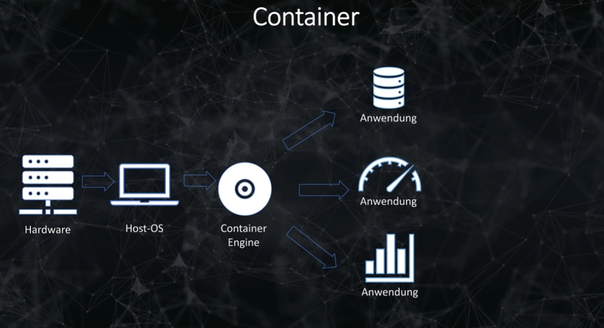
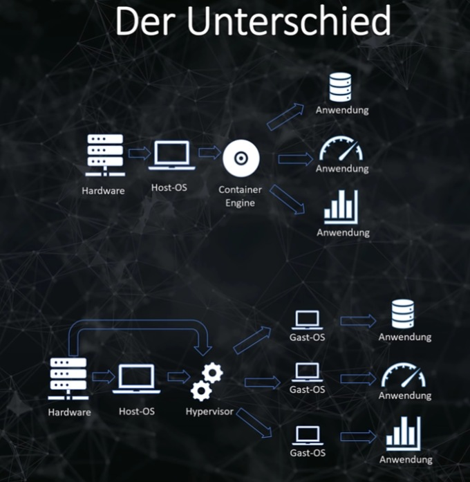

# Virtuelle Maschinen vs Container / Docker

## Bild Virtuelle Maschinen 

## Bild Container / Docker 

## Unterschied 

### 1. Architektur

**Virtuelle Maschinen (VMs):**
- **Hypervisor**: VMs laufen auf einem Hypervisor, der für die Virtualisierung der Hardware verantwortlich ist. Der Hypervisor kann entweder direkt auf der Hardware (Typ 1, z.B. VMware ESXi) oder auf einem Betriebssystem (Typ 2, z.B. VirtualBox) installiert sein.
- **Gastsystem**: Jede VM enthält ein vollständiges Betriebssystem (Gast-OS) sowie die notwendigen Bibliotheken und Anwendungen.
- **Isolierung**: VMs sind vollständig voneinander isoliert, da sie jeweils ihr eigenes Betriebssystem haben.

**Container:**
- **Container-Engine**: Container laufen auf einer Container-Engine (z.B. Docker), die die Container verwaltet und den Zugriff auf die Betriebssystem-Ressourcen koordiniert.
- **Gemeinsam genutzter Kernel**: Container teilen sich den Kernel des Host-Betriebssystems und benötigen daher kein eigenes Betriebssystem. Dies macht sie leichtgewichtiger.
- **Isolierung**: Container bieten Prozess- und Dateisystem-Isolierung, jedoch nicht die gleiche starke Isolierung wie VMs, da sie den gleichen Kernel verwenden.

### 2. Leistung

**Virtuelle Maschinen:**
- **Overhead**: VMs haben einen höheren Overhead, da sie ein vollständiges Betriebssystem ausführen müssen. Dies kann die Leistung beeinträchtigen, insbesondere bei I/O-intensiven Anwendungen.
- **Startzeit**: Das Booten einer VM dauert länger im Vergleich zu einem Container, da ein vollständiges Betriebssystem geladen werden muss.

**Container:**
- **Leichtgewichtig**: Container sind ressourceneffizienter, da sie den Kernel des Host-Systems nutzen und nicht das gesamte Betriebssystem virtualisieren müssen.
- **Startzeit**: Container starten schneller als VMs, oft in Sekundenbruchteilen, da sie nur die Anwendung und ihre Abhängigkeiten laden müssen.

### 3. Ressourcenverbrauch

**Virtuelle Maschinen:**
- **Speicher und CPU**: VMs benötigen mehr Speicher und CPU-Ressourcen, da jedes Gast-OS zusätzlichen Speicherplatz und CPU-Leistung beansprucht.
- **Ressourcenverwaltung**: Der Hypervisor muss die Ressourcen zwischen den VMs verwalten, was zusätzlichen Overhead verursacht.

**Container:**
- **Effizienz**: Container nutzen Ressourcen effizienter, da sie das Host-Betriebssystem teilen. Dies führt zu einem geringeren Speicher- und CPU-Bedarf.
- **Dichte**: Mehrere Container können auf dem gleichen Host ausgeführt werden, was eine höhere Dichte und bessere Ressourcennutzung ermöglicht.

### Zusammenfassung

**Virtuelle Maschinen (VMs):**
- Bieten starke Isolierung und Sicherheit durch vollständige Betriebssysteme.
- Haben höheren Overhead und längere Startzeiten.
- Sind ideal für Umgebungen, in denen vollständige Betriebssystem-Isolierung erforderlich ist.

**Container:**
- Sind leichtgewichtiger und effizienter, da sie den Kernel des Host-Systems nutzen.
- Haben geringeren Overhead und schnellere Startzeiten.
- Sind ideal für Microservices-Architekturen und Entwicklungsumgebungen, in denen Effizienz und Skalierbarkeit wichtig sind.

**Fazit:** Container sind in vielen modernen Anwendungsfällen, insbesondere in der Cloud-nativen Entwicklung und bei Microservices, eine bevorzugte Wahl aufgrund ihrer Effizienz und Flexibilität. Virtuelle Maschinen bleiben jedoch relevant für Szenarien, die eine starke Isolierung und Kompatibilität mit verschiedenen Betriebssystemen erfordern.